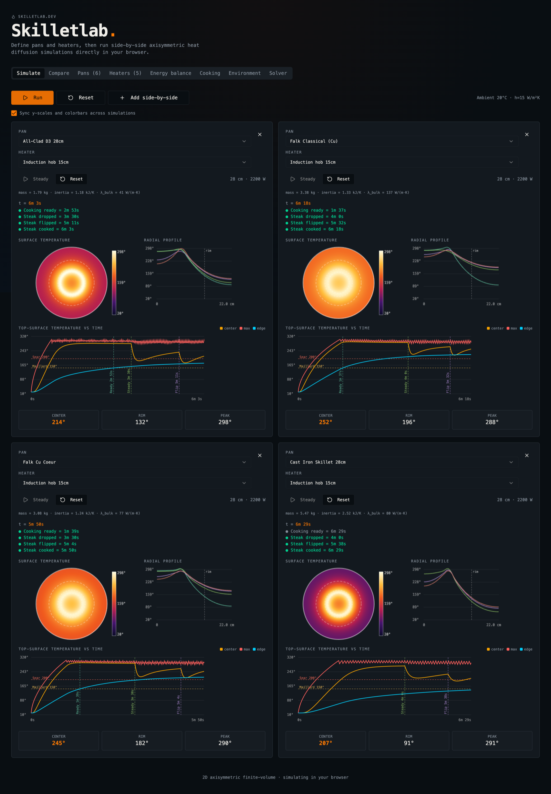

# Skilletlab

An interactive **2-D axisymmetric heat-diffusion solver** for multi-layer frying pans on circular heaters, running entirely in the browser. Configure pans and heaters, drop a virtual steak, watch the temperature field evolve, click anywhere on the time-series to inspect a snapshot, and compare configurations side by side.

→ **Live:** [skilletlab.dev](https://skilletlab.dev)



## What it actually does

The solver discretises the cylindrical heat equation on a non-uniform (r, z) finite-volume mesh:

```
ρ·c · ∂T/∂t = (1/r) · ∂/∂r(r · k · ∂T/∂r) + ∂/∂z(k · ∂T/∂z) + S
```

with these features:

- **Time integration**: Crank–Nicolson via Peaceman–Rachford ADI (each half-step is a tridiagonal solve via the Thomas algorithm). Unconditionally stable in time; second-order accurate.
- **Boundary conditions**:
  - `z = 0` (pan bottom): annular heater flux on the heater-ring footprint; adiabatic elsewhere on the cooking-zone bottom; linearised convection + radiation Robin on the rim's underside.
  - `z = H` (pan top): linearised convection + radiation Robin to ambient.
  - `r = R_pan` rim: another linearised Robin loss.
  - Per-pan **rim-radiation recapture**: a configurable fraction of the rim's top-face radiation is re-injected as a uniform flux on the cooking surface.
- **Heater hysteresis**: setpoint-high / setpoint-low thermostatic cycling driven by the top-surface temperature at the heater radius.
- **Steady-state detection**: sliding-window convergence on `min(T_center, T_edge)` (window size user-configurable in the Solver tab).
- **Optional steak phase**: an axisymmetric beef cylinder dropped on first steady. The pan and steak couple through an explicit contact conductance at z = H. The steak is flipped (axial T-reversal) when its centre cell reaches 25 °C. Final stopping criterion: the coldest cell anywhere in the steak reaches the user's done temperature.
- **Base-plate geometry**: per-layer flag that lets some layers stop at the cooking radius (the "stem" of a stick-applied base plate) while others extend to the full rim — produces a squashed-T cross-section.
- **Energy bookkeeping**: cumulative heater input, stored energy, convective + radiative loss to ambient. The conservation residual `|E_in − E_stored − E_conv − E_rad|` is plotted on a log axis and stays at floating-point noise for well-resolved cases.

The full physics & numerics specifics are documented at the top of [`src/lib/simulation.ts`](src/lib/simulation.ts).

## Stack

- **Vite 7** + **React 19** + **TypeScript** — vanilla SPA, no server.
- **TanStack Router** for client-side routing (file-based, with `@tanstack/router-plugin`).
- **Tailwind v4** + **shadcn/ui** + **Radix** for the UI primitives.
- **Web Worker** owns all `SimState` instances; main thread only renders. Snapshots posted at ~60 Hz via structured clone.
- **Canvas 2D** for every chart (line, profile, heatmap, residual). One immediate-mode draw per chart per snapshot keeps overhead bounded across ~20 charts redrawing in lockstep.
- Custom transparent **SVG overlay** for hover tooltips and click-to-pin interaction on the canvas charts.

## Development

```bash
npm install
npm run dev      # http://localhost:3000
npm run build    # → dist/ (pure static, no server)
npm run lint
```

Build output (`dist/`) is fully static — drop it behind any static host (nginx, Cloudflare Pages, Netlify, etc.). There is no backend; all computation runs in the user's browser via a Web Worker.

## Repository layout

```
src/
├─ lib/
│  ├─ simulation.ts       FV / CN-ADI solver core
│  ├─ sim.worker.ts       Web Worker entry — owns SimState, posts snapshots
│  ├─ useSimulations.ts   React hook + worker plumbing
│  ├─ configs.ts          Pan + heater templates, localStorage-backed
│  ├─ pan-properties.ts   Derived metrics (mass, heat capacity, bulk λ)
│  ├─ colormap.ts         Thermal colormap for the heatmap
│  └─ format.ts           "Ns" / "Mm Ns" sim-time formatter
├─ components/
│  ├─ SimCard.tsx              Per-sim card on the Simulate tab
│  ├─ EnergyCard.tsx           Per-sim card on the Energy-balance tab
│  ├─ PanView.tsx              Top-down heat-map + colorbar
│  ├─ ProfileChart.tsx         Radial T profile with milestone overlays
│  ├─ TempHistoryChart.tsx     Top-surface T vs time with click-to-pin
│  ├─ ChartHoverOverlay.tsx    Shared SVG hover + click overlay
│  ├─ CompareCharts.tsx        Cross-sim comparison plots
│  ├─ ConfigEditors.tsx        Pan + heater editors (Pans / Heaters tabs)
│  └─ ui/                      shadcn primitives
└─ routes/
   ├─ __root.tsx
   └─ index.tsx           Main app shell, tabs, global state
```
